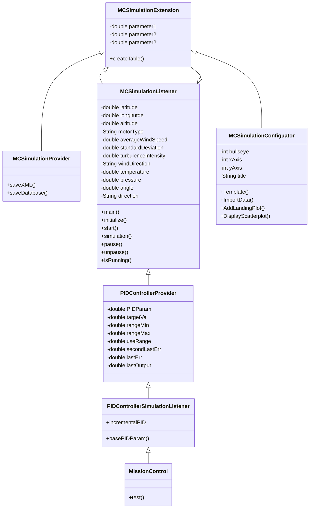
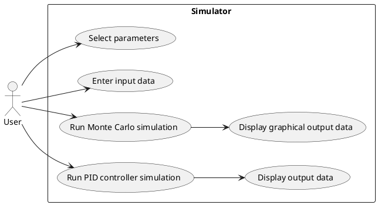
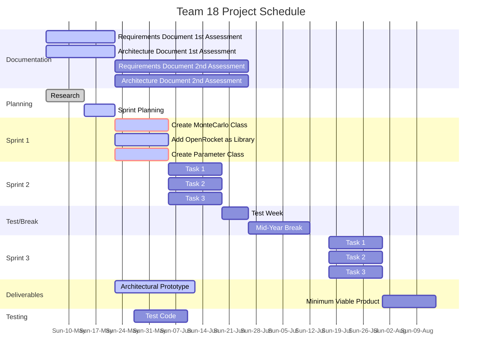

# ENGR 301: Architectural Design and Proof-of-Concept

## Proof-of-Concept

    The aim of an architectural proof-of-concept (spike or walking skeleton) is to demonstrate the technical feasibility of your chosen architecture, to mitigate technical and project risks, and to plan and validate your technical and team processes (e.g., build systems, story breakdown, Kanban boards, acceptance testing, deployment).

    A walking skeleton is an initial technical attempt that will form the architectural foundation of your product. Since a walking skeleton is expected to be carried into your product, it must be completed to the quality standards expected for your final product. A walking skeleton should demonstrate all the technologies your program will rely on "end-to-end" &mdash; from the user interface down to the hardware.

    In the context of ENGR 301, a walking skeleton does not need to deliver any business value to your project: the aim is technical validation and risk mitigation.


## Document

    The aim of the architectural design document is to describe the architecture and high-level design of the system your group is to build, to identify any critical technical issues with your design, and to explain how you have addressed the highest rated technical and architectural risks. The architecture document should also demonstrate your understanding of architectural techniques and architectural quality, using tools and associated notations as necessary to communicate the architecture precisely, unambiguously and clearly in a written technical document.

    Page specifications below are *limits not targets* and refer to the pages in the PDF generated from the markdown. Because the size of your document is necessarily limited, you should ensure that you focus your efforts on those architectural concerns that are most important to completing a successful system: if sections are at their page limit, indicate how many items would be expected in a complete specification.

    The ENGR 301 project architecture design document should be based on the standard ISO/IEC/IEEE 42010:2011(E) _Systems and software engineering &mdash; Architecture description_, plus appropriate sections from ISO/IEC/IEEE 29148:2018(E) _Systems and software engineering &mdash; Life cycle processes &mdash; Requirements engineering_; ISO/IEC/IEEE 15289:2017 _Systems and software engineering &mdash; Content of life-cycle information items (documentation)_; ISO/IEC/IEEE 15288:2015 _Systems and software engineering &mdash; System life-cycle processes_; ISO/IEC/IEEE 12207:2017 _Systems and software engineering &mdash; Software life cycle processes_ and ISO 25010 SQuaRE; with notations from ISO/ISE 19501 (UML). In particular, Annex F of ISO/IEC/IEEE 15288 and Annex F of ISO/IEC/IEEE 12207. These standards are available through the Victoria University Library subscription to the [IEEE Xplore Digital Library](https://ieeexplore.ieee.org/) (e.g., by visiting IEEE Xplore from a computer connected to the University network).

    The document should contain the sections listed below, and conform to the formatting rules listed at the end of this brief.

    All team members are expected to contribute equally to the document and list their contributions in the last section of the document (please make sure that your continued contribution to this document can be traced in GitLab). You should work on your document in your team's GitLab repository in a directory called "M2_Architecture". If more than one team member has contributed to a particular commit, all those team member IDs should be included in the first line of the git commit message. ``git blame``, ``git diff``, file histories, etc. will be tools used to assess individual contributions, so everyone is encouraged to contribute individually (your contribution should be made to many sections of the document, rather than focusing on just a single section), commit early and commit often.

# ENGR 301 Project 18 Architectural Design and Proof-of-Concept

**Authors:** Pawan, James, Adam, Kirsty, Charlotte, Dom

## 1. Introduction

    One page overall introduction including sections 1.1 and 1.2 (ISO/IEC/IEEE 42010:2011(E) clause 5.2)

Amateur rockets are frequently launched all over New Zealand.  Such rockets frequently surpass the speed of sound and altitudes above 30 km. These very same rockets are also not controlled, as they depended upon passive aerodynamic design elements to keep them stable. Although, these rockets, when well developed, can be fairly simple and reliable, they are also very much vulnerable to a magnitude of outcomes. Especially, in the very beginning of the flight. This is partly due to the number of variables at play. Such as wind speed, rocket build/ combination of rocket components, launch angle, parachute ejection time, rocket performance, ect. MonteCarlo simulations are used to create a summerised simulation output that best describes the likleyness of a rockets landing position.


### Client

Andre Geldenhuis

### 1.1 Purpose

By automating simulations predicting the rockets flight path we can gain a good understanding on the excpected outcome of a rocket launch. Our system will allow useres to
preform Monte Carlo simulations for a given rocket example. This means they are able to run "Batch" testing to view an average expected outcome. These simulations will be shown
visualy on a dot plot style diagram.

PID controlers are used as a control mechanism that givesfeed back to the system. This feedback is used to accurately menoveer the rocket in small steps ensuring there is no overcompensation.

(Insert a line about PID controller as well)

### 1.2 Scope

Our system will allow useres to input specific rocket values for a given simulation, the inputs available are what is currently available within openrocket. This simulation will repeat for a given amount of time, each simulation will have an outcome. These outcomes will be locations the rocket will land. This is called a Monte Carlo simulation. These locations will be visualised in a dotplot style image represeting a targeted possition. The system will provide a view on nearby objects such as house and other infetructure. Areas of collision will be highlighted and warned to the user, this will theoreticaly prevent accidents in real life
launches.

Our PID system will control the rockets movement adjustments...  (Again, insert a line about PID controller as well... add more)

### 1.3 Changes to requirements

    If the requirement have changed significantly since the requirements document, outline the changes here. Changes must be justified and supported by evidences, i.e., they must be substantiated. (max one page, only if required)

There are no changes to the requirements as of present.

## 2. References

    References to other documents or standards. Follow the IEEE Citation Reference scheme, available from the [IEEE website](https://ieee-dataport.org/sites/default/files/analysis/27/IEEE%20Citation%20Guidelines.pdf) (PDF; 20 KB). (1 page, longer if required)

    1) ISO/IEC/IEEE Systems and software engineering -- Architecture description," in ISO/IEC/IEEE 42010:2011(E) (Revision of ISO/IEC 42010:2007 and IEEE Std 1471-2000) , vol., no., pp.1-46, 1 Dec. 2011, doi: 10.1109/IEEESTD.2011.6129467.

..

## 3. Architecture

    Describe your system's architecture according to ISO/IEC/IEEE 42010:2011(E), ISO/IEC/IEEE 12207, ISO/IEC/IEEE 15289 and ISO/IEC/IEEE 15288.

    Note in particular the note to clause 5 of 42010:

    _"The verb include when used in Clause 5 indicates that either the information is present in the architecture description or reference to that information is provided therein."_

    This means that you should refer to information (e.g. risks, requirements, models) in this or other documents rather than repeat information.

### 3.1 Stakeholders

    See ISO/IEC/IEEE 42010 clause 5.3 and ISO/IEC/IEEE 12207 clause 6.4.4.3(2).

    For most systems this will be about 2 pages, including a table mapping concerns to stakeholder.
    
#### Stakeholder Register:

**Project clients:**
* Aaron Chen
* Craig Anslow

**Customers:**
* Andre Geldenhuis 
* Wider amateur rocket community

**Support Staff:**
*  Electronics Technicians: Tim, Jason & Hamish
*  IT and programmers: Mark, Royce, Christo, Radek
*  Heath & Safety: Roger
*  Administration: ECS Admin team 

| **Name** | **Position** | **Internal/External** | **Project Role** | **Contact Information** |
| ------ | ------ | ------ | ------ | ------ |
| **Stakeholder 1** | Aaron Chen | Internal | Course Co-ordinator | aaron.chen@vuw.ac.nz |
| **Stakeholder 2** | Craig Anslow | Internal | Lecturer | craig.anslow@vuw.ac.nz |
| **Stakeholder 3** | Andre Geldenhuis | External | Client/customer | andre.geldenhuis@vuw.ac.nz |

#### Stakeholder Identification:

Our stakeholders can be identified by having concerns the system stakeholders considered fundamental to the architecture of the system-of-interest.

**Users of the system:** The general users of this system will be a subset of the OpenRocket user community. Specifically being, those who are wanting to use additional functionality from our system, such as; the ability to run Monte Carlo simulations.  

**Operators of the system:** The operators of the system includes; the host programming language (Java), any dependencies, such as; additional frameworks, additional libraries, the user’s computer and operating system. Another being, the OpenRocket code base, as we are running our system through OpenRocket as a plug in

**Acquirers of the system:** ...

**Owners of the system:** These include; VUW, OpenRocket, Help. Additionally, any users who have acquired an instance of the program/ codebase. As our system is piggybacking on OpenRocket as a plug in. OpenRocket is an Open-source software piece. Please see below for the definition of this.

Open-source software (OSS) is any computer software that's distributed with its source code available for modification. That means it usually includes a license for programmers to change the software in any way they choose: They can fix bugs, improve functions, or adapt the software to suit their own needs.

**Suppliers of the system:** ...

**Developers of the system** These primarily include our team. However, in the future, this can also include any other induvial developers who contribute to the code base. Such as; developers part of the OpenRocket community.

**Builders of the system:** ...

**Maintainers of the system:** These include; developers of the OpenRocket community.


#### Stakeholder Concerns:

Our concerns are identified by being considered fundamental to the architecture of the system-of-interest.

* Aaron Chen 
* Craig Anslow
* Andre Geldenhuis
* The OpenRocket Developer Community 
* The OpenRocket User Community 
* Our Team 

| **Stakeholder** | **The purposes of the system** | **The suitability of the architecture for achieving the system’s purposes** | **The feasibility of constructing and deploying the system** | **The potential risks and impacts of the system to its stakeholders throughout its life cycle** |**Maintainability and evolvability of the system** |
| ------ | ------ | ------ | ------ | ------ |------ |
| Aaron Chen                    | .. |.. | :heavy_check_mark: |.. | .. |
 | Craig Anslow                 | .. |.. | :heavy_check_mark: |.. | .. |
| Andre Geldenhuis              |  :heavy_check_mark: | .. |  :heavy_check_mark: |.. | :heavy_check_mark: |
| The OpenRocket User Community |  :heavy_check_mark: | .. |.. |.. | :heavy_check_mark: |
| The OpenRocket Developer Community  | .. | .. |.. |.. | :heavy_check_mark: |
| Our Team                      |   :heavy_check_mark: | :heavy_check_mark: | :heavy_check_mark: | :heavy_check_mark: |:heavy_check_mark: |

### 3.2 Architectural Viewpoints
    (1 page, 42010 5.4) 

    Identify the architectural viewpoints you will use to present your system's architecture. Write one sentence to outline each viewpoint. Show which viewpoint frames which architectural concern.

**Logical:** The logical viewpoint describes the functionality of the system it provides to end-users; the viewpoint breaks the system down into key concepts, which are represented using class and state diagrams.

Mission controls teams have implemented a function that allows them to collect the weather data for high altitudes, which means that part of our Monte Carlo simulation will need to implement a function that allows the system to be able to retrieve this data and use it. The data will be inputed as a cvs file. 

**Development:** The development viewpoint describes the architecture that supports the processes involved in the software development cycle aims to address concerns regarding the management of the software.

**Process:** The process viewpoint deals with the dynamic and non-functional requirements of the system, such as performance and availability, addressing concurrency and distribution of the system's integrators and how main abstractions from the logical view fit within the process architecture.

**Physical:** The physical viewpoint details how the software fits within the given hardware, mapping software to different parts of the hardware for single and multi-system architectures; in particular, it deals with hardware availability, reliability, performance, and scalability of the system.

**Scenarios:** The scenario viewpoint is a collection of use cases that describe the interactions between users or processes, used as a qualitative review of a given architecture and form the basis for the tests of the architecture.

### 4. Architectural Views

    (5 sub-sections of 2 pages each sub-section, per 42010, 5.5, 5.6, with reference to Annex F of both 12207 and 15288) 

    Describe your system's architecture in a series of architectural views, each view corresponding to one viewpoint.

    You should include views from the following viewpoints (from Kruchten's 4+1 model):
     * Logical
     * Development
     * Process
     * Physical 
    * Scenarios - present scenarios illustrating how two of your most important use cases are supported by your architecture

    As appropriate you should include the following viewpoints:
     * Circuit Architecture
     * Hardware Architecture

    Each architectural view should include at least one architectural model. If architectural models are shared across views, refer back to the first occurrence of that model in your document, rather than including a separate section for the architectural models.



### 4.1 Logical
```
The logical view is concerned with the functionality that the system provides to end-users. 
UML diagrams are used to represent the logical view, and include class diagrams, and state diagrams
```

The Monte Carlo simulations and PID controller tuning and design software will be implemented through a plug in, within Openrocket. 
It has been decided that the lastest version of OpenRocket (v15.03) will be the version supported by the plugin, with the user only having to download the plugin's .jar file, then follow the readme instructions. 

From the class diagram illustrated above, external data such as weather and map data will be pulled from external sources, formatted then used within the Monte Carlo simulation and PID controller classes. 
The MCSimulation class will also pull information/data from the users data (InputData class), and the external data sources. It will then run the different calculations, radomizing the input values for each of the successive simulations, until it reaches the number of simulations programmed (approx 1000) to give a resonable distribution of the landing plots. 
On the users end, once the monte carlo simations are complete, it will graphically output a bullseye graph with each landing plot marked. It will also advise users how close it is to any dangerous sites such as buildings or trees. 
The PID controller class will also pull the information/data from the users data (InputData class), calculate the step throughs of the motor gimbles, then output the data to then be further alanysed by the end users.
The data held from each simulation collection (will be multiple simulations in each), and PID controller simulations, can then be save in the database or exported to a .CVS file, as per the standards fomulated in the interteam's planning and documentation. 

### 4.2 Development
```
he development view illustrates a system from a programmer's perspective and is concerned with software management. 
This view is also known as the implementation view. It uses the UML Component diagram to describe system components. 
```
*To do: Include a UML diagram with packages/component here.*

From a high level overview of the system from a programmer's persepective, the software will be written in java and will call on instances of the OpenRocket API to beable to integrate the two systems. 
Both the Monte Carlo and PID controller will have their own classes, but will call on other classes such as the user input class and the export classes to be able to run its functions and output the data to the users. 
Due to the amount of computations being run within each simulation, to keep latency minimal, will be looking into potential concurrent and parellel system designs. 

We have decided to use OpenRocket's simulation plug-in gateway - "Simulation Extensions".

Simulation Extensions allow you to modify a simulations before or during it happens/ is happening. They also allow for controlling almost every aspect of a particular simulation. The way in which we are going to using them is by extending the abstract classes. Which allows for maximum compatibility with future versions of OpenRocket - when new methods are added to the interfaces.

This involves the use of three main classes:
- Simulation extension class
- Simulation extension provider
- Simulation extension configurator

**Simulation extension class:** Which is an instance of the simulation extension class. It is attached to each simulation that has the extension defined as part of it. It contains the configuration of the extension and a method that is called when the simulation is run. 

From OpenRocket's website: to implement AbstractSimulationExtension and at least the initialize method. This method is called whenever a simulation run is started. It can modify the SimulationConditions, which contains the launch conditions of the simulation. It can also attach simulation listeners to the simulation, which allows interacting with the simulation while it is running.

**Simulation extension provider:** Which is a factory class that creates instances of the simulation extension. It also provides an ID string identifying the simulation extension and the name and menu location of the extension.

From OpenRocket's website: When using AbstractSimulationExtensionProvider you only need to provide the constructor the simulation extension class and the name and menu location. A single simulation extension provider can be used to provide multiple simulation extensions. For example, the provider could scan a directory for scripts and provide a simulation extension for each script file. The abstract class assumes you are only providing a single simulation extension.

**Simulation extension configurator:** This is the separate configurator GUI dialog which is used to  configure a single instance of a simulation extension. It is implemented as a separate plugin so that the plugin itself can be used also on platforms not supporting Swing.

From OpenRocket's website: WSwingSimulationExtensionConfigurator provides a ready framework where you only need to implement the getConfigurationComponent method, where you add the necessary components to a ready JPanel.


### 4.3 Process
```
The process view deals with the dynamic aspects of the system, explains the system processes and how they communicate, 
and focuses on the run time behavior of the system. The process view addresses concurrency, distribution, integrator, 
performance, and scalability, etc. 
```
*To do: Include a sequenctail diagram here.* 

This is still being designed and discussed by the team and consulation is still needed with the client. 
At this stage, we understand that chaching the base distribution and its convolutions may be an option with the run time behaviours for the Monte Carlo. 
Also the team is aware that this software will demands extensive raw computation power therefore will be looking into how to mitigate this. 

### 4.4 Physical 
```
The physical view depicts the system from a system engineer's point of view. 
It is concerned with the topology of software components on the physical layer as well as the physical connections between these components. 
This view is also known as the deployment view. 
```

*To do: Include a deployment diagram here.*

SOFTWARE TOPOLOGY:
- Show how the monte carlo and PID controller will interact with the hardware. 
- While there is not a physical paring of the two, the simulations are in order to aid the hardware and allow its users to make changes needed based on the simulations rather than testing solely on the field. 
- So the software must be designed to have the correct data all the way through, e.g. input data, calculations, output data. The software must also ensure that it has gone through various and rigorous testing. 

### 4.5 Scenarios




Two of the most inportant use cases:
- Graphically presenting the landing plots from the monte carlo simulator to the user. 
- Outputting data from the PID controller simulation for the users to be able to analyse for the tuning and design of their mission control. 

*To do: Include a diagram to illustrate the connections between the two senarios and the rest of the system*

    > Notes from 42010:
    > A viewpoint is a way of looking at systems; a view is the result of applying a viewpoint to a particular system-of-interest. 
    > The relationship between viewpoint and view suggests this metaphor:
            view : viewpoint :: program : programming language2
    > A viewpoint specifies the conventions (such as notations, languages and types of models) for constructing a certain kind of view. That viewpoint can be applied to many systems. Each view is one such application. Similarly, a program is one instance of applying a programming language to a specific situation or design problem. 
    
    > 5.5 Architecture views
    > An architecture description shall include exactly one architecture view for each architecture viewpoint used.
    > Each architecture view shall adhere to the conventions of its governing architecture viewpoint.
    > Each architecture view shall include:
    > a) identifying and supplementary information as specified by the organization and/or project;
    > b) identification of its governing viewpoint;
    > c) architecture models that address all of the concerns framed by its governing viewpoint and cover the
    > whole system from that viewpoint;
    > d) recording of any known issues within a view with respect to its governing viewpoint.
    > NOTE 1 See 5.2 NOTE for examples of identifying and supplementary information per a).
    > NOTE 2 The requirement per c) that each architecture view covers the whole system with respect to the concerns
    > framed by its governing viewpoint is essential to the complete allocation of concerns within an architecture description.
    > Within a view, one or more architecture models can be used to selectively present portions of the system to highlight
    > points of interest, without violating this requirement (see 5.6).
    > NOTE 3 “Known issues” per d) include unresolved issues, exceptions and deviations from the conventions. Open
    > issues can lead to decisions to be made. Exceptions and deviations can be documented as decision outcomes and
    > rationale (per 5.8).
    > An architecture description may include information not part of any architecture view.
    > EXAMPLES Instances of information not part of any view are system overview, model correspondences and
    > architecture rationale.

    > 5.6 Architecture models
    > An architecture view shall be composed of one or more architecture models.
    > Each architecture model shall include version identification as specified by the organization and/or project.
    > Each architecture model shall identify its governing model kind and adhere to the conventions of that model
    > kind (see 5.4). 
    > An architecture model may be a part of more than one architecture view.
    > NOTE 1 Sharing architecture models between architecture views permits an architecture description to frame distinct
    > but related concerns without redundancy or repetition of the same information in multiple views, and reduces possibilities
    > for inconsistency. Sharing of architecture models also permits an aspect-oriented style of architecture description:
    > architecture models shared across architecture views can be used to express architectural perspectives (see [36]);
    > architecture models shared within an architecture view can be used to express architectural textures (see [34]).
    > Architecture models can be used as “containers” for applying architecture patterns [4] or architecture styles to express
    > fundamental schemes (such as layers, three-tier, peer-to-peer, model-view-controller) within architecture views.
    > NOTE 2 This International Standard does not prescribe how architecture models are created. They can be individually
    > constructed, derived from or based upon other models. 


## 5. Development Schedule

    _For each subsection, make clear what (if anything) has changed from the requirements document._ If unchanged, these sections should be copied over from the requirements document, not simply cross-referenced.

    Schedules must be justified and supported by evidences; they must be either direct client requirements or direct consequences of client requirements. If the requirements document did not contain justifications or supporting evidences, then both must be provided here.

### 5.1 Schedule

Please find the relevant section [here](https://gitlab.ecs.vuw.ac.nz/course-work/engr300/2020/group18/group-18/-/edit/master/project_requirement/project-requirement.md#51-schedule)



The above shows the project schedule until after the third sprint (Friday 31st July). The sprint schedule is based on the schedule reccomended in the Lecture given by Craig on 
Wednesday 20th of May, and also repeated through the announcements channel on Mattermost. 

The period up until the first sprint was predominantly concerned with research and planning, (as well as a break due to Covid-19). 

During the first sprint the team will develop classes which will be able to aquire data from OpenRocket, and run a simple MonteCarlo simulation as required from the client in the [Rocket Project pdf.](https://ecs.wgtn.ac.nz/foswiki/pub/Courses/ENGR301_2020T1/Project/2020_Rocket_Project_info.pdf)
Subsequent sprints will focus on creating a crude simulation of a PID controller as also required in the Rocket Controller pdf, while also extending the MonteCarlo functionality
to include weather and map data as requested in later interactions with the client.

#### Gitflow Diagram:

The diagram below showcases our gitflow. For this project we have incorporated various issue branches which relate to features within our kanban/issues board. 
Once an issue is ready, a merge request is made to the deveoplement branch. Once in the developement branch, after all issues for the sprint have be merged, the developement branch is then merged with the master branch ready for release. 
This cycle repeats each sprint until the final MVP is hit and the project comes to an end. 


### 5.2 Budget and Procurement

#### 5.2.1 Budget

*Present a budget for the project (as a table), showing the amount of expenditure the project requires and the date(s) on which it will be incurred. Substantiate each budget item by reference to fulfilment of project goals (one paragraph per item).
(1 page).*
 

Please find the relevant section [here](https://gitlab.ecs.vuw.ac.nz/course-work/engr300/2020/group18/group-18/-/edit/master/project_requirement/project-requirement.md#52-budget)

At this stage there are no anticipated costs for this project. This has the potential to change, depending on whether we need any hosting or licenses (AWS etc) .

#### 5.2.2 Procurement

*Present a table of goods or services that will be required to deliver project goals and specify how they are to be procured (e.g. from the School or from an external organisation). These may be software applications, libraries, training or other infrastructure, including open source software. Justify and substantiate procurement with reference to fulfilment of project goals, one paragraph per item.
(1 page).*


### 5.3 Risks 

*Identify the ten most important project risks: their type, likelihood, impact, and mitigation strategies (3 pages).*

Please find the relevant section [here](https://gitlab.ecs.vuw.ac.nz/course-work/engr300/2020/group18/group-18/-/edit/master/project_requirement/project-requirement.md#53-risks)

| #| Risk | Type |Likelihood |Impact |Mitigation |
| ------| ------ | ------ |  ------ |------ |------ |
| 1 | Group member illness | Schedule | Moderate | Serious | Rotating roles around, documenting code well, coding to an outline | 
| 2 | Inability to connect with Avionics/Mission control teams | Technical | Moderate | Tolerable | Make sure that our code is robustly compatible with OpenRocket in the hope that they also use OpenRocket |
| 3 | Underestimating software size | Delivery | High | Tolerable | Finalising architecture early, and leaving just over a week contingency time at the end of the project.  | 
| 4 | Breakdown in team communication | Operational | Moderate | Catastrophic | Ensure that team members are consistently checking and updating communication channels, and encouraging an environment where all team members questions and input is considered.  |
| 5 | Inability to integrate with OpenRocket | Technical | Low | Catastrophic | Making sure to ask questions of the client and project coordinators to achieve proper guidance for integration.  |
| 6 | Poor project management structure  | Operational | Moderate | Serious | Making sure that we create a suitable management process/ structure that works well for each member of the group  |
| 7 | Poor Estimation and scheduling  | Technical | High | Serious | Try to think at the highest level as early on in the project as possible to develop a holistic understanding to be better equipt to avoid this.  |
| 8 | Deviation from project deliverables | Operational | High | Serious | Operating agile. Iterative check ins with customer, tutor and group. |
| 9 | Inadequate Knowledge or Skills | Technical | Mild | Moderate | Allowing and accounting for time for members to develop the missing knowledge or skills |
| 10 | ... | ... | ... | ... | ... | ... | ... |  

### 5.4 Health and Safety

    Document here project requirements for Health and Safety.
    
#### 5.4.1 Safety Plans

    Safety Plans may be required for some projects, depending on project requirements.
    

    (( remove: Document here project requirements for Health and Safety. All teams must state in this section: ))

**1. How teams will manage computer-related risks such as Occupational Over Use, Cable management, etc.**

We will manage computer related risks by following a hazard management process that will help us to:
- Identify potential health issues 
- Identify potential hazardous areas
- Propose controls to eliminate or mitigate the hazards to reduce the health issues

1. 	Health issues:
-	Physical discomfort
-	Visual discomfort
-	Stress 
-	Fatigue

2. Hazard areas:
-	Work Organisation:  
-	Postures
-	Practices

3. 	Hazard Controls:

Work Organisation: We will aim to ensure all work is collectively well managed and organised.

To do this, we will:
-	Ensure there is sufficient resources and time to do an assigned task 
-	Plan our work to our best ability
-	Encourage two-way communication 
-	Have the same understanding of expectations
-	Allow each member to 
o	apply a variety of skills and capabilities 
o	undertake a range of activities through the project
o	contribute to the overall purpose of the project
o	have control over the priority, pace and procedure of the project
o	develop existing skills and build new skills

We will actively avoid:
-	Overload/ underload of work
-	Under stimulating work
-	Unwarranted allocated repetitive tasks
-	Unwarranted time pressure
-	A member working alone without opportunities for contact with others 

Postures: We will aim to adopt good postural habits.

To do this we will follow these recommendations for computer users:
-	How to sit while working: [here](https://ibb.co/FKz2hCW)
-	How to stand while working: [here](https://ibb.co/yFh364Q)

Additionally, we will:
-	Adopt a range of well supported postures. 
-	Avoid saying in the same posture for prolonged periods 

Practices: We will aim to incorporate breaks and pauses when we work.

Breaks: 
-	Be frequent
-	Be taken more often than the regular morning, lunch and afternoon breaks
-	Be at least five to ten minutes every hour or timed to match a natural break or change in the work
-	Be a complete break away from the computer

Micro Pauses: frequent and regular pauses built into the work
-	Taking the hands from the keyboard and hanging the arms down by the side
-	Complete relaxation of the shoulders, arms, hands and fingers
-	Changing eye focus by looking away from the screen at distant objects (at least two to three metres away), for example looking out the window. 

**2. Whether project work requires work or testing at any external (off-campus) workplaces/sites. If so, state the team's plans for receiving a Health and Safety induction for the external workplaces/sites. If the team has already received such an induction, state the date it was received.**

All development and testing will be done internally, on campus at VUW, or remotely. For example from home. This is mainly because we will be hosting all of our code, required documents and other files on, the version control system, Gitlab. 

**3. Whether project work requires the team test with human or animal subjects? If so, explain why there is no option but for the team to perform this testing, and state the team's plans for receiving Ethics Approval _prior_ to testing.**

The scope of this project does not require us to test with humans or animal subjects.

**Also document in this section any additional discussions with the School Safety Officer regarding Health and Safety risks. Give any further information on relevant health and safety regulations, risks, and mitigations, etc.**

- Health and Safety at Work Act (2005)
- VUW Health and Safety Policy (2016)
- Safe Campus Policy (2013)

#### 5.4.1 Safety Plans

    Safety Plans may be required for some projects, depending on project requirements. Safety Plan templates are available on the course Health & Safety page. Two questions all teams must answer are:

**Do project requirements involve anything that can cause serious harm or death?**  

    (( remvove: Examples: building/modifying devices using voltages > 60 V, chemicals, large moving machinery, flying devices, bodies of water.
    If so, you will have to write a separate Safety Plan as part of project requirements, and the Safety Plan must be referenced in this section. For health and safety risks involving serious harm or death, you must first contact the School Safety Officer and Course Coordinator first to discuss the Safety Plan and project requirements. ))

Project requirements do not involve risk of serious harm or death.

**Do project requirements involve anything that can cause harm or injury?** 

    (( remove: Examples: building/modifying things with voltages <= 60V, small moving machinery, wearable devices.
    If so, you will have to write a separate Safety Plan as part of project requirements, and the Safety Plan must be referenced in this section. For health and safety risks involving harm or injury, you should write a draft of the Safety Plan before contacting the School Safety Officer and Course Coordinator to discuss the Safety Plan and project requirements.
    If a safety plan is required, list in this section the date the School Safety officer accepted your Health and Safety plan (if accepted by submission date).
    If the project is purely software and requires no contact risks involving physical harm, then state)) 

Project requirements do not involve risk of death, serious harm, harm or injury.

## 6. Appendices

### 6.1 Assumptions and dependencies 

    One page on assumptions and dependencies (9.5.7) 

### 6.2 Acronyms and abbreviations

    One page glossary as required 

## 7. Contributions

    An one page statement of contributions, including a list of each member of the group and what they contributed to this document.

#### Adam  
- 
- 

#### Kirsty 
- 4.0 created the class diagram in markdown from what was discussed as a team
- 4.1 Logical
- 4.2 Development
- 4.3 Process
- 4.4 Physical
- 4.5 Scenarios

#### Pawan 
- 
- 

#### Charlottle 
- 5.1 Schedule
- 5.2 Budget
- 5.3 Risks

#### James
- 5.1 Project schedule (init)
- 5.3 Risks
- 5.4 Health and Safety
- 5.4.1 Safety Plans
- 3.4 Performance requirements
- 3.2 Functions
- 5.2 Budget

## Formatting Rules 

    * Write your document using [Markdown](https://gitlab.ecs.vuw.ac.nz/help/user/markdown#gitlab-flavored-markdown-gfm) in your team's GitLab repository.
    * Major sections should be separated by a horizontal rule.


## Assessment 

    This document will be weighted at 20% on the architectural proof-of-concept(s), and 80% on the architecture design.

    The proof-of-concept will be assessed for coverage (does it demonstrate all the technologies needed to build your project?) and quality (with an emphasis on simplicity, modularity, and modifiability).

    The document will be assessed by considering both presentation and content. Group and individual group members will be assessed by identical criteria, the group mark for the finished PDF and the individual mark on the contributions visible through `git blame`, `git diff`, file histories, etc. 

    The presentation will be based on how easy it is to read, correct spelling, grammar, punctuation, clear diagrams, and so on.

    The content will be assessed according to its clarity, consistency, relevance, critical engagement and a demonstrated understanding of the material in the course. We look for evidence these traits are represented and assess the level of performance against these traits. Inspection of the GitLab Group is the essential form of assessing this document. While being comprehensive and easy to understand, this document must be reasonably concise too. You will be affected negatively by writing a report with too many pages (far more than what has been suggested for each section above).
